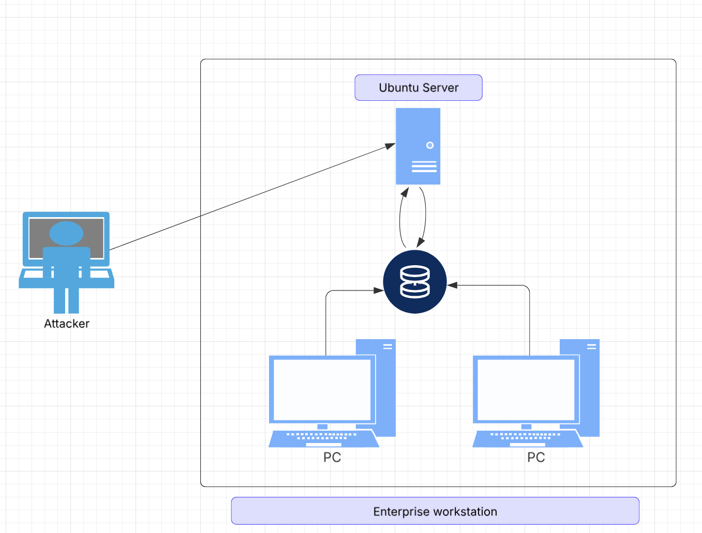

# HomeLab 🔐🛡️ 
# Content:

- **Project Overview**
- **Homelab infrastructure**
- **Network Topologies**
- **Installation & Setup**
- **Attack Scenario**
- **Challenges and Solutions**

🚀**Project Overview**

This homelab walks through the process of setup, configuring ,securing, and simulate cyber attack (brute force attack through SSH)and apply some defense security ways .

Also apply cyber attack phases like:

- **Reconnaissance**
- **Exploitation:** 
- **Persistence:** 
- **Defense:** 

✨**Homelab Infrastructure**

- **Host Machine**: Hosted on a MacBook Air machine (macOS Sequoia v.15 )
- **Hardware**:
    - **CPU/Chip** : Apple M1  (ARM architecture)
    - **RAM**: 8GB
    - **Storage**: 256GB SSD

  [More Details](https://support.apple.com/en-us/111883)  

- **VM Machines :**

**Windows 11 Enterprise:** This will be used to simulate a business server/user 

**Ubuntu 24.04 (Target machine):** This will be used to simulate an enterprise software development environment.

**Kali Linux(Attacker machine)**: It comes pre-installed with a wide range of tools for vulnerability assessment,

exploitation, wireless testing, and digital forensics.

✨**Network Topologies:**

✨**Installation 🏗️**

**Prerequisites**

- Upgrade your host machine to latest version
- Check the Virtual Platform App compatibility with your host machine architecture
- List all iso images you need and list their sizes
- make sure you have enough space , if not you can check other workarounds ( ex: Cloud )

🛠️ **Setup**

1. Install Virtual Platform (parallels app)
2. Install all required iso images 
3. Configure network , IP setting if needed
4. Setup required tools
5. Start your attack scenarios

✨**Attack Scenario** 

In this part of the lab series, we are going to simulate an end-to-end cyber-attack on business network. The end goal is to have access and achieve persistence inside the business network by apply [Cyber attack kill chain phases](https://www.lockheedmartin.com/en-us/capabilities/cyber/cyber-kill-chain.html) 

Please refer to this document for more detailes:
https://treasure-gaura-631.notion.site/HomeLab-Content-1aa45f9874d08097813afac8865cd129

💡 **Challenges and Solutions**

- Virtual platform selection was time waste for your first time without define selection requirements in terms of compatibility ,storage and user usability .

- Host machine space limitation , try below steps :

     Clean your unwanted App & large documents

     Empty your trash 

     make sure there is no copy of old VM on your machine

     Finally , if you still have space issue try to check other cloud options (AWS,Azure ,Google Cloud **)**

- Cloud options limitations:

    AWS : Require “Microsoft Remote Desktop” which is restricted in Egypt 

   GCP : By default, GCP VMs don’t come with a GUI ,only terminal usage

   Azure: signup issues not eligible in all countries 

📚**Useful links:**

https://projectsecurity.teachable.com/courses/build-a-cybersecurity-homelab-a-practical-guide-to-offense-defense-enterprise-101/lectures/59385586

https://cyberwoxacademy.com/building-a-cybersecurity-homelab-for-detection-monitoring/

https://www.youtube.com/watch?v=fsjs8XTi8JI&t=326s
